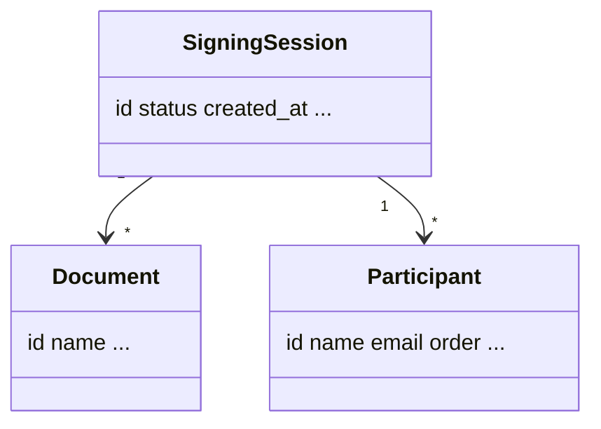

# EasyInk Docs: Style Guide

This guide keeps our docs consistent, fast to read, and easy to maintain.

## Principles
- **Audience-first.** Write for senders, admins, developers, and signers. Call out who it applies to.
- **Examples first.** Start with a runnable example, then explain concepts.
- **Short, active, second person.** “You click **Finalize**…” Keep sentences under ~20 words.
- **Task-oriented.** Prioritize steps the reader can complete right now.
- **UI-true.** Use the exact UI labels and capitalization.
- **No marketing fluff.** Avoid superlatives; state facts and limits.

## Canonical terminology (use exactly)
| Use | Don’t use | Notes |
|---|---|---|
| **Participant** / **participants** | recipient(s) | “Recipient” may appear in legacy text; replace with **participant**. |
| **Email** | e-mail, E-mail | Lowercase “email” unless starting a sentence. |
| **SMS** | sms, text, sms/text | Use “SMS” for the channel; “text message” only in prose when needed. |
| **Finalize** | Finalise, finalization step | Button label; bold it. |
| **Start now** / **Start later** | Start, send now | Use the exact prompt labels. |
| **Download All** | download bundle, export | Button label; bold it. |
| **First Name**, **Last Name** | First name, Last name | Match UI capitalization for field labels. |
| **Settings set** | settings-set, settingsset | One per organization; can be shared across orgs. |
| **Template overlay** | template, overlay template (unless UI) | “Template overlay” is the doc term; match UI where it appears. |
| **Notification sender** | from address, mailer | The configured From identity. |
| **Signing session** | envelope, case | Our primary container term. |

> **Tip:** If UI labels change, update this table and run a find/replace sweep across the repo.

## Formatting rules
- **Markdown only.** No HTML in body content. Use Mermaid for diagrams.
- **Frontmatter required.** Every page starts with YAML frontmatter (see template below).
- **Headings.** One `#` H1 per page (matches the page title). Use `##` for sections, `###` for subsections.
- **Bold UI labels.** Buttons, menu items, fields: **Finalize**, **Start now**, **+ Add document**.
- **Lists over text walls.** Prefer numbered steps for procedures.
- **Tables for references.** Use compact tables for options, statuses, error matrices.
- **Callouts.** Use exactly:
  - **Note:** context or side conditions.
  - **Tip:** productivity win.
  - **Caution:** risks or irreversible actions.

## Link style
- **Relative links only.** `../admin/settings-sets.md`
- **Descriptive anchors.** Avoid “click here.” Prefer “See [Template overlays](../admin/template-overlays.md).”
- **No dead ends.** Every page ends with **Related reading** that suggests the next action.

## Frontmatter template
```yaml
---
title: "<Concise page title>"
description: "<One-sentence value statement>"
audience: ["senders" | "admins" | "developers" | "signers"]
keywords: ["e-sign", "signing sessions"]
easyink_version: "web"
last_reviewed: "YYYY-MM-DD"
related: ["../path/to/related-one.md", "../path/to/related-two.md"]
---
```

## Page types and required elements

### Quickstart
- Goal statement.
- 3–5 short sections with numbered steps.
- Troubleshooting table for top 3 issues.
- **Related reading**.

### How-to
- “Applies to” line.
- **Overview**, **Before you begin**, **Steps**, **Troubleshooting**, **API** (TBD today), **Related reading**.
- Use exact UI paths and labels.

### Concept
- **Example first** (short scenario).
- **How it works** with entities and lifecycle.
- **Data model** (Mermaid).
- **Related reading**.

### Admin
- **Overview**, **Before you begin**, **Steps**, **Fields reference**, **Troubleshooting**, **FAQs**, **Related reading**.
- Emphasize role/permission prerequisites.

### Troubleshooting
- **Quick diagnostic** checklist.
- Symptom → Cause → Fix → Time to verify table.
- Environment notes when relevant.
- **Related reading**.

## Screens, diagrams, and assets
- Favor **steps + labels** over screenshots to reduce UI drift.
- Store diagrams in `docs/_assets/diagrams/`.
- Mermaid is preferred for flows and models.
- If you must include a screenshot, keep it small and crop to the relevant area.

## Style mechanics
- **Tense/voice:** Present, active (“Click **Finalize**”, “Open **Home**”).
- **Capitalization:** Match UI. Sentence case elsewhere.
- **Numbers:** Use numerals (1, 2, 3). Use `1–5 min` for time-to-verify.
- **Dates:** Use ISO `YYYY-MM-DD` in frontmatter and examples where appropriate.
- **File paths:** Use code ticks for paths and UI items only when clarity improves.

## Content hygiene
- No secrets, tokens, or internal endpoints.
- Use fake data in examples (`alex@example.com`, `+15551234567`).
- For non-prod, note allow-lists and purge windows.
- When adding **TBD**, include **owner** and **due date**.

## Lint & review aids
- Run a “terminology sweep” before PR:
  - `recipient|recipients` → `participant|participants`
  - `e-mail` → `email`
  - `sms|sms/text` → `SMS`
- Click-test all relative links.
- Ensure **Related reading** exists and is relevant.
- Bump `last_reviewed` on touched pages.

## Examples to copy

### How-to skeleton
```markdown
# <Action verb>: <object>
**Applies to:** senders | admins | developers | signers

## Overview
<when and why>

## Before you begin
- Roles
- Access
- Inputs/files
- Environment note (if relevant)

## Steps
1. ...
2. ...

## Troubleshooting
| Symptom | Cause | Fix | Time to verify |
|---|---|---|---|

## API
Not applicable today. (Add cURL/Node/Python once API is public.)

**Related reading**
- See also: ...
```

### Concept skeleton
```markdown
# <Concept name>

## Example first
<short example flow>

## How it works
- Entities
- Lifecycle/states
- Security/permissions

## Data model


**Related reading**
- See also: ...
```

**Related reading**
- See also: [Contributing](CONTRIBUTING.md)  
- See also: [Glossary](docs/glossary.md)  
- See also: [Quickstart: send your first document](docs/get-started/quickstart.md)
