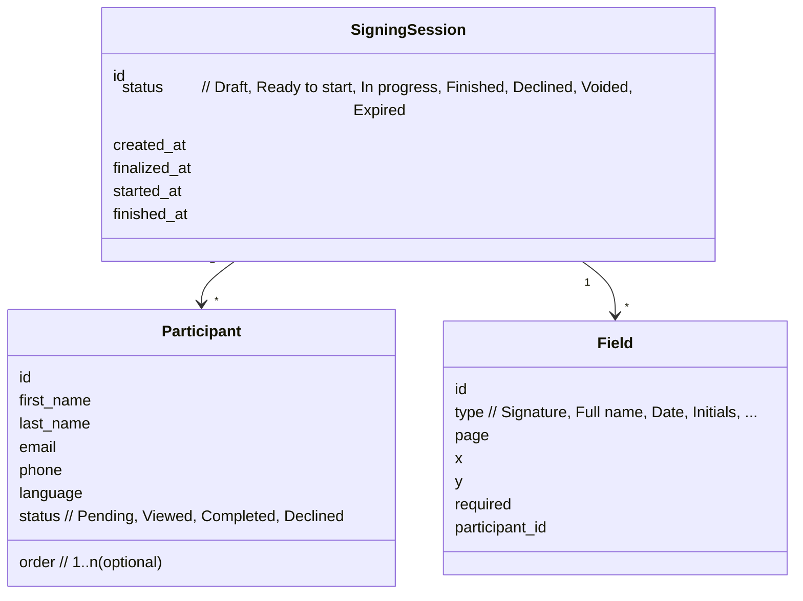

# Participants and roles

## Example first
You add two **participants** to an NDA:
- **Manager** (order **1**)
- **Employee** (order **2**)

You place **Signature** and **Date** fields for both, **Finalize**, then **Start now**.  
The **Manager** signs first. Only after they finish can the **Employee** open and sign.  
When both complete, the session becomes **Finished** and you can **Download All**.

## How it works
- **Participant (canonical term)**  
  A person who signs. You provide **First Name**, **Last Name**, **Email**, optional **Phone** and **Language**. Fields are placed for the **active participant**.
- **Signing order (optional)**  
  Use numeric order (**1..n**) to enforce sequence. Order gaps are allowed (e.g., 1, 3, 5) but add complexity—prefer consecutive numbers.
- **Fields**  
  Each required signer needs at least one **required** field (e.g., **Signature**). Optional fields are allowed for additional data.
- **Statuses (per participant)**  
  **Pending** → **Viewed** → **Completed**; or **Declined**. A participant’s completion contributes to the session reaching **Finished**.
- **Delivery**  
  Invitations use your org’s **notification sender** (From name/address) and follow rules in the org’s **settings set** (expiry, SMS quiet hours).

> **Tip:** Keep participant display names consistent with your HR/CRM for better audits and search.

## Roles and permissions (impact on participants)
- **Standard User**
  - Create sessions, add/edit participants in **Draft**.
  - Place fields, set **Signing order**, **Finalize**, **Start now**.
  - **Resend** invitations; view status and activity.
- **Administrator**
  - Everything a Standard User can do, plus **Change signing session** (edit after start) and **Void** sessions.
  - Manage org-level configuration (**settings sets**, **notification senders**, **template overlays**).

> **Caution:** Editing participants after **Start now** requires **Change signing session** permission and may invalidate placements; review fields and **Finalize** again.

## Data model

**Related reading**
- See also: [Roles and permissions](../admin/roles-permissions.md)  
- See also: [Signing sessions](./signing-sessions.md)  
- See also: [Create and start a signing session](../how-to/create-and-send-document.md)
