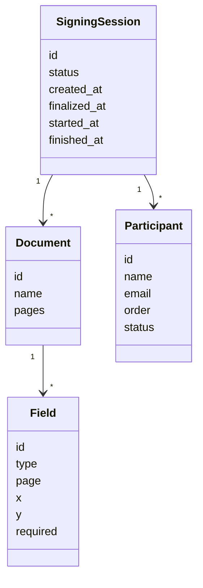

# Signing sessions

## Example first
You upload a PDF, add two **participants**, place **Signature** and **Date** fields, click **Finalize**, then **Start now**.  
The session moves from **Draft** → **Ready to start** → **In progress** → **Finished** when both sign.

## How it works
- **Entities**
  - **Signing session** holds **documents**, **participants**, and **fields**.
  - **Participants** sign in optional **order**.
  - **Fields** are placed per **active participant** on each page.
- **Lifecycle / states**
  - **Draft** → editable; add docs, participants, fields.
  - **Ready to start** → finalized; waiting for **Start now**.
  - **In progress** → invites sent; participants are signing.
  - **Finished** → all required signatures complete.
  - **Declined** → a participant declined to sign.
  - **Voided** → an authorized user cancelled the session.
  - **Expired** → deadline passed (per **settings set**).
- **Security / permissions**
  - **Standard User** can create, finalize, and start sessions.
  - **Administrator** can also **Change signing session** (edit after start) and **Void** sessions.
  - Org-level defaults (sender, expiry, SMS) come from the **settings set**.

## Data model

**Related reading**
- See also: [Create and start a signing session](../how-to/create-and-send-document.md)  
- See also: [Roles and permissions](../admin/roles-permissions.md)  
- See also: [Troubleshooting: sending and signing](../troubleshooting/sending.md)
