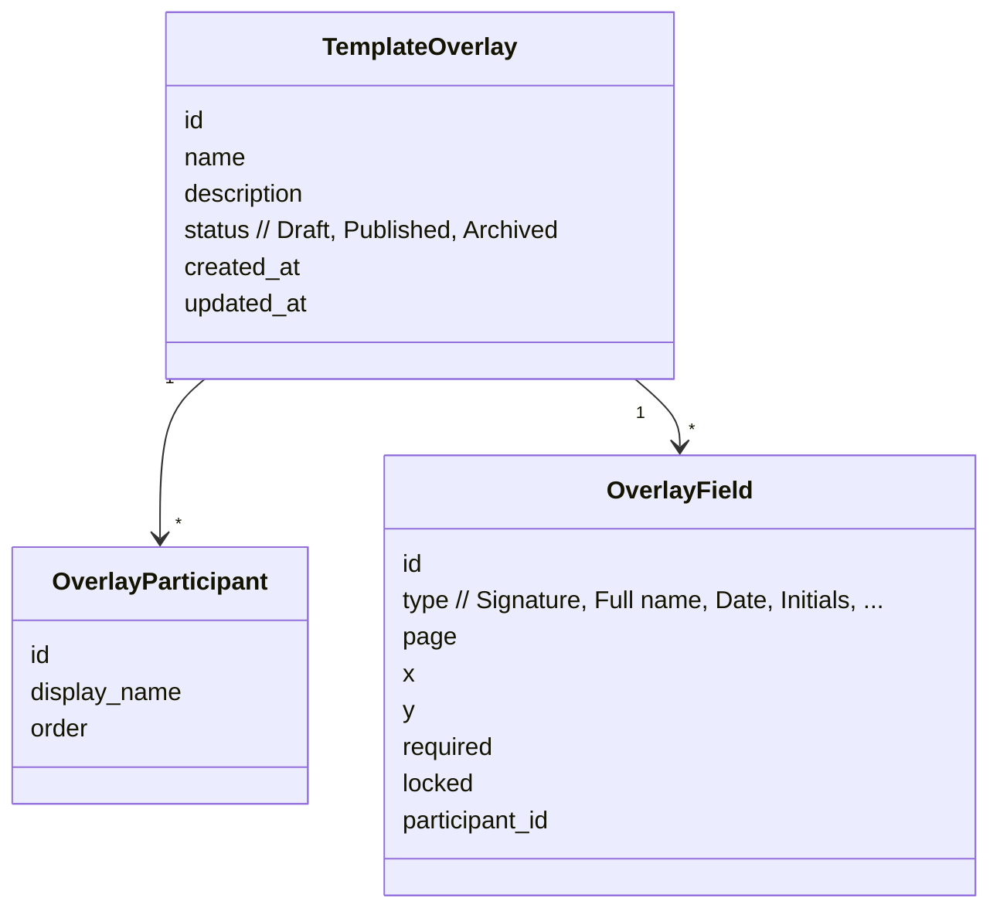

# Templates and overlays

## Example first
You send the same NDA every week. Create an overlay called **“NDA – Candidate”** with:
- Participants: **Candidate** (order 1), **Hiring Manager** (order 2).
- Page 1: **Signature** (Candidate), **Date** (Candidate).
- Page 2: **Signature** (Hiring Manager), **Date** (Hiring Manager).

During a new session, upload the NDA and click **Apply template overlay → NDA – Candidate**. The participants and fields load in the right places. You click **Finalize**, then **Start now**.

## How it works
- **Overlay = structure + placements.**  
  Stores default **participants**, optional **signing order**, and pre-placed **fields** bound to page coordinates of a reference layout.
- **Ad-hoc = manual placement.**  
  You can always place fields by hand for a one-off document.
- **Locking (optional).**  
  Admins may lock placements so senders can’t move them after applying.
- **Source of truth.**  
  Overlays don’t control sender identity or expirations. Those come from the org’s **settings set**.
- **Lifecycle.**  
  **Draft** → **Published** → **Archived**. Only **Published** overlays appear to senders.

## Data model

## When to use overlays vs ad-hoc
- Use **overlays** when:
  - Layout repeats (NDAs, onboarding, policy acks).
  - You want consistency and fewer placement errors.
  - You expect multiple senders to use the same pattern.
- Use **ad-hoc** when:
  - The document changes often and unpredictably.
  - You’re prototyping a new flow (then **Save as template overlay** later).

> **Tip:** If the overlay almost fits a new variant, adjust the fields and **Save as template overlay** to create a tailored version.

## Limits and edge cases
- **Page changes:** If the base PDF page order/size changes, placements can shift. Re-align and re-publish.
- **Participants provided by overlay:** First/Last Name are placeholders; **Email** is filled at send time.
- **Locked fields:** Only admins can edit after apply if locking is enabled.
- **Archived overlays:** Existing sessions keep their placements; overlay just disappears from pickers.

**Related reading**
- See also: [Template overlays (admin)](../admin/template-overlays.md)  
- See also: [Create and start a signing session](../how-to/create-and-send-document.md)  
- See also: [Quickstart: send your first document](../get-started/quickstart.md)
